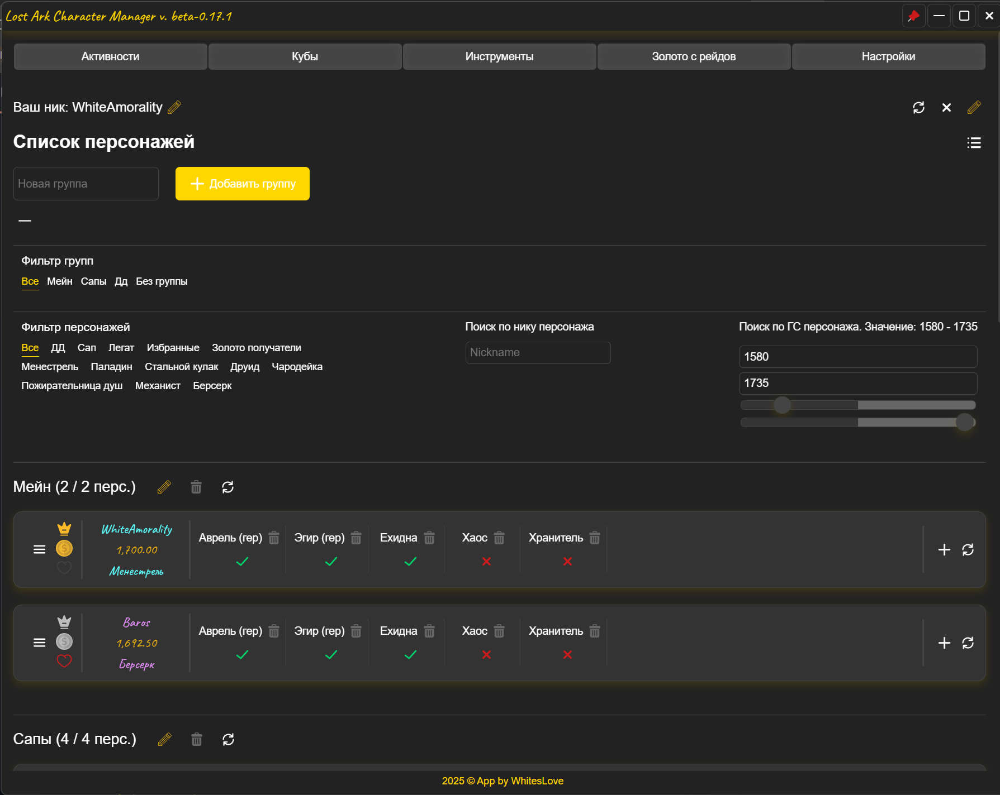
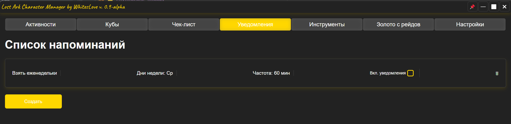
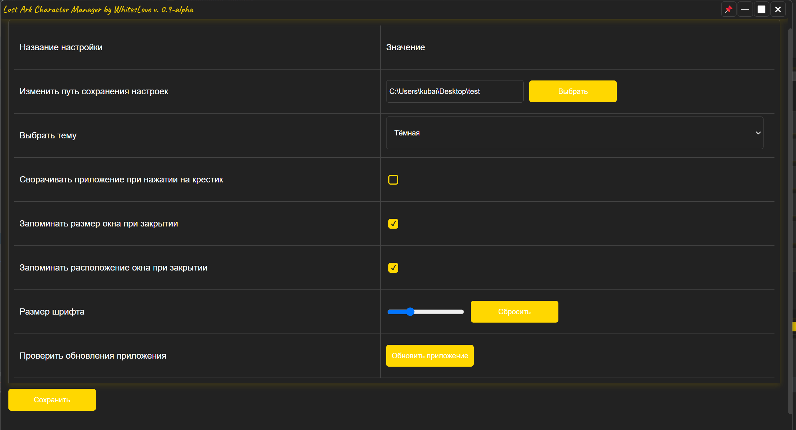
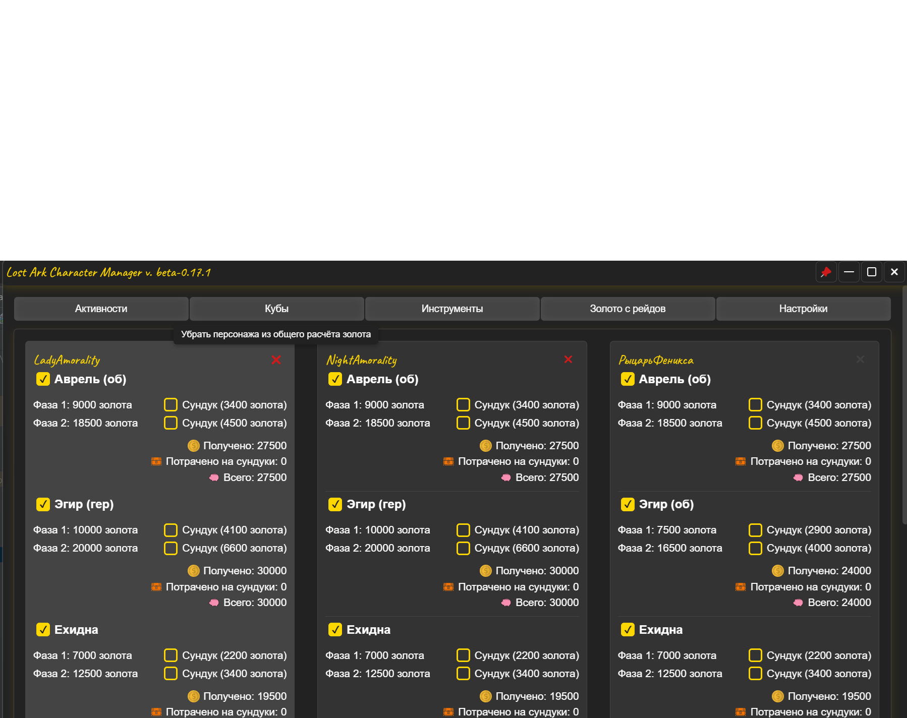
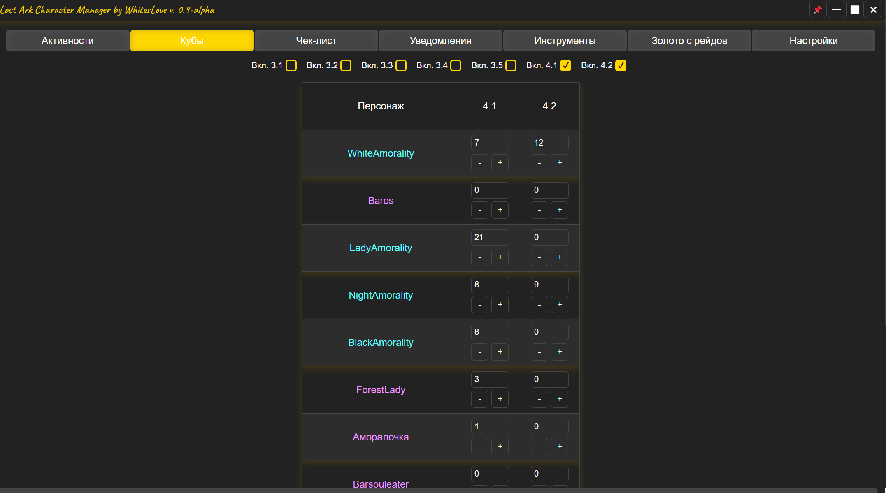

# 🧾 Account Status LA

**Account Status LA** — это десктопное приложение для игроков в **Lost Ark**, позволяющее удобно отслеживать прогресс аккаунта, персонажей, активности, напоминания и другую полезную информацию в одном месте.

---

## ⚙️ Основные возможности

### 🧍 Персонажи
- Отображение списка всех ваших персонажей с их:
    - Ником, классом, уровнем снаряжения (GS).
    - Ролью (легат, получатель золота, избранный и т.д.).
- Управление порядком с помощью **Drag & Drop**.
- Режим редактирования — включение и отключение отображения персонажа.
- Отметки пройденной активности персонажем с авто сбросом каждый день и в среду

---

### ✅ Чек-лист
- Простое создание и удаление задач.
- Отметка выполненных дел.
- Подходит для трекинга целей в игре.

---

### 🔔 Напоминания
- Создание кастомных уведомлений:
    - Настройка частоты (каждые 1, 5, 15, 30 минут, 1 или 2 часа).
    - Указание дней недели.
    - Переключение активности напоминания.
- Уведомления приходят через **центр уведомлений Windows**.

---

### 💎 Простые калькуляторы для удобства игрока
- Калькулятор недостающих карт для колоды:
  - Поддержка расчёта количества недостающих карт для прокачки до 30 уровня.
  - Указание уровня и количества лишних копий.
  - Подсчёт:
      - Недостающих карт.
      - Прогресса по каждой карте.
- Калькулятор оптимальной и максимальной ставки на аукционе
  - рассчитывается из соображений получения от 15% прибыли 
- Калькулятор комиссии
  - сколько нужно отправить золота другому игроку, чтобы он получил конкретную сумму после вычета комиссии
- Калькулятор выгоды
  - Можно рассчитать количество золота, которое получит n количество игроков от размера ставки на аукционе в рейде
- Калькулятор количества кубов
  - Позволяет легко посчитать необходимое количество Т4.1 и Т4.2 кубов для сбора камня требуемого уровня. 
  - Можно рассчитывать включая камни, которые уже есть на руках, так и без и без них.
- Калькулятор заточки фетранита
- Калькулятор выгодности покупки за золото или чёрные кристаллы
  - Позволяет рассчитать, насколько покупка за чёрные кристаллы будет дороже или дешевле в отношении покупки за золото
- Калькуляторы для расчёта количества ресурсов для крафта авидорских кристаллов
---

### 🪙 Калькулятор полученного золота из рейдов
- Можно исключать персонажа из расчёта
- Можно указать, что был выкуплен сундук на какой-то из фаз или на всех фазах
- Можно указать, что рейд был пройден без золота
- Расчёт золота автоматически для легата и золотополучателей, для "избранного" и неотмеченных персонажей есть возможность включить их в общий расчёт
- Авто сброс каждое новое КД
---

### 🪙 Онлайн-модуль для отслеживания прогресса других пользователей
- Можно выделять пользователей как "избранных"
- Можно отслеживать рейды пользователя, нажав на его карточку
- Ваша личная информация будет обновляться при переходе на страницу "Подписки"
---

### ⚒️ Дополнительные возможности
- Настройки окна:
    - Сворачивание при закрытии.
    - Запоминание позиции и размера.
    - Поверх всех окон.
- Выбор темы интерфейса:
    - Темная, светлая, синяя, розовая, мятная, градиентные и другие стили.
- Изменение размера шрифта (по категориям: заголовки, основной текст и т.д.)
- Выбор шрифта.
- Изменение пути сохранения настроек.
- Выбор вкладок для отображения
---

## 🚀 Установка и запуск

### 📦 Установка
1. Скачайте последнюю версию из [релизов](https://github.com/your-repo/account_status_la/releases).
2. Распакуйте архив (если это portable версия) или запустите установщик.

### ▶️ Запуск
- Запустите `Lost Ark Character Manager.exe`.
- Настройте путь к сохранению данных и выберите тему.

---

## 📁 Сохранение данных
Все данные сохраняются локально в JSON-файлах и могут быть экспортированы.

---

## 🧠 Разработка
Приложение построено на:
- ⚙️ [Electron](https://www.electronjs.org/)
- ⚡ [Vite](https://vitejs.dev/)
- 🖼 [Vue 3](https://vuejs.org/)
- 🎨 SCSS (темы и стили)

---

## 📸 Скриншоты

- Главный экран с персонажами.
- 
- Напоминания.

- Настройки.

- Отслеживание количества золота с рейдов.

- Отслеживание количества кубов.

---

# Как начать пользоваться

- Для того, чтобы ваши персонажи подтянулись в программу, на первой странице необходимо ввести свой игровой ник. 
- Спустя некоторое время ваши персонажи будут загружены и вы сможете их базово настроить.
- Если вы хотите скрыть какого-то персонажа из списка, нажмите на крестик.
- После сохранения статусов персонажей, вы сможете задать им активности, нажав по плюсику в плашке каждого персонажа.
- Вы можете вести одновременно несколько аккаунтов в одной сессии.
- Вы можете менять порядок персонажей при помощи drag & drop.
- Персонажи, которые были скрыты на первой странице, не будут отображаться на остальных страницах - кубах, расчётах золота.
___
- В случае если при смене ника ваши персонажи **не подгрузились**, пожалуйста, нажмите на кнопку справа в углу - **две стрелочки**, это запустит загрузку заново. 
- Прерывать загрузку как-либо настоятельно не рекомендуется.
- Чтобы снова настроить своих персонажей, нажмите на иконку карандаша справа в углу.
- Вы можете переподтягивать группу персонажей
- Вы можете переподтягивать конкретного персонажа

## 📬 Обратная связь

Если у вас есть предложения, баги или пожелания — создайте issue или напишите автору проекта в Discord (Ник: whiteslove) /на GitHub/Patreon.

---